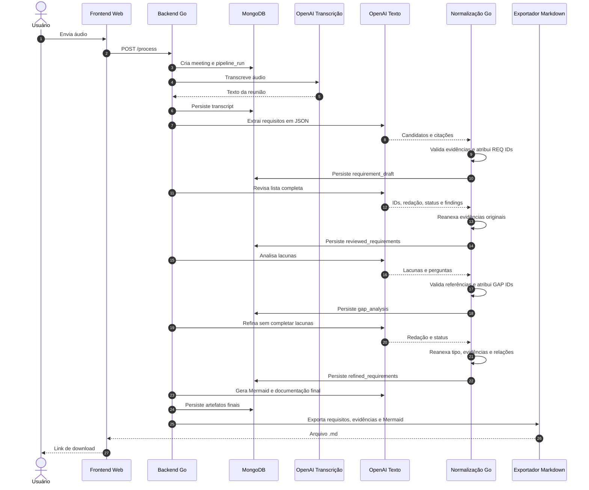
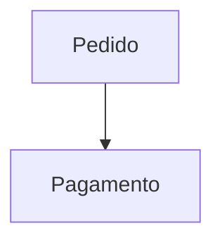

# Requirement Pipeline

MVP em Go para transformar o áudio de uma reunião de elicitação em requisitos estruturados, rastreáveis e auditáveis. A pipeline usa IA para transcrição e análise textual, mas mantém na aplicação a responsabilidade por IDs, evidências, validação de schemas e persistência.

Este README também registra decisões metodológicas da pipeline para apoiar a futura escrita do artigo científico do TCC.

## Requisitos

- Go 1.26 ou mais recente
- MongoDB acessível pela aplicação
- Chave da OpenAI em `OPENAI_API_KEY`

Node.js, Puppeteer e Mermaid CLI não são necessários em runtime. Os diagramas são mantidos como blocos Mermaid no documento Markdown final.

## Configuração

A aplicação carrega `.env` automaticamente e depois lê as variáveis de ambiente. Variáveis exportadas no ambiente têm prioridade sobre o arquivo.

- `OPENAI_API_KEY`: obrigatória para execução real com OpenAI
- `OPENAI_TRANSCRIPTION_MODEL`: padrão `gpt-4o-transcribe`
- `OPENAI_TEXT_MODEL`: padrão `gpt-5`
- `MONGO_URI`: padrão `mongodb://localhost:27017`
- `MONGO_DATABASE`: padrão `requirement_pipeline`
- `PIPELINE_DEFAULT_LANGUAGE`: padrão `pt-BR`

Para iniciar um MongoDB local com Docker:

```bash
docker run -d \
  --name requirement-pipeline-mongo \
  -p 27017:27017 \
  -v requirement-pipeline-mongo-data:/data/db \
  mongo:7
```

Se o container já existir:

```bash
docker start requirement-pipeline-mongo
```

## Execução

### CLI

```bash
go run ./cmd/requirement-pipeline \
  -title "Reunião de descoberta" \
  -audio ./meeting.mp3 \
  -language pt-BR
```

Ao final, a CLI exporta:

```text
output/requirements_<pipeline-run-id>_<meeting-id>.md
```

Outro diretório pode ser escolhido com `-out`:

```bash
go run ./cmd/requirement-pipeline \
  -title "Reunião de descoberta" \
  -audio ./meeting.mp3 \
  -out ./exports
```

Para reprocessar uma reunião existente:

```bash
go run ./cmd/requirement-pipeline -meeting-id "<meeting-id>"
```

Cada reprocessamento cria um novo `pipeline_run`.

Para exportar uma execução sem chamar novamente a OpenAI:

```bash
go run ./cmd/requirement-pipeline -export-run-id "<pipeline-run-id>"
```

### Frontend Web

```bash
go run ./cmd/requirement-pipeline -web -addr :8080
```

Abra `http://localhost:8080`, envie o áudio e aguarde o processamento. Durante o envio, a página mostra um estado visual de loading, bloqueia envios duplicados e informa que a operação pode levar alguns minutos.

Uploads são salvos temporariamente em `uploads/` e removidos ao final da requisição. Documentos Markdown são salvos em `output/` e servidos por `/downloads/<arquivo>.md`.

## Fluxo Da Pipeline

| Ordem | Etapa | Entrada principal | Saída | Contrato |
| --- | --- | --- | --- | --- |
| 1 | `audio_transcription` | Áudio | `transcript` | Texto |
| 2 | `requirement_extraction` | Transcrição | `requirement_draft` | JSON validado |
| 3 | `requirement_review` | Rascunho completo | `reviewed_requirements` | JSON validado |
| 4 | `gap_analysis` | Requisitos revisados | `gap_analysis` | JSON validado |
| 5 | `requirement_refinement` | Requisitos revisados e lacunas | `refined_requirements` | JSON validado |
| 6 | `diagram_generation` | Requisitos refinados | `business_diagrams` | JSON validado |
| 7 | `artifact_generation` | Requisitos refinados | SRS, histórias, critérios e casos de uso | JSON validado com quatro campos |



O fonte desse diagrama também fica em `docs/diagrams/pipeline-sequence.mmd`.

## Metodologia De IA

### Motivação

Quando extração, revisão, análise de lacunas e refinamento são tratados como textos livres, surgem quatro problemas centrais:

1. Uma revisão pode produzir somente um relatório de críticas enquanto a etapa seguinte espera uma lista completa de requisitos.
2. Instruções como "identifique requisitos implícitos" e "complete as lacunas" podem levar o modelo a promover inferências a fatos.
3. Sem IDs e evidências obrigatórios, a rastreabilidade não pode ser verificada programaticamente.
4. Sem contratos, cada etapa pode alterar o formato e aumentar muito o volume textual, elevando latência, custo e risco de perda de informação.

A pipeline trata a saída do modelo como dado não confiável que precisa passar por normalização determinística antes de virar artefato persistido.

### Separação de responsabilidades

A IA é responsável por tarefas semânticas:

- identificar requisitos candidatos;
- classificar tipo e estado epistemológico;
- revisar redação e consistência;
- apontar lacunas;
- melhorar clareza;
- produzir diagramas e documentação derivada.

A aplicação Go é responsável por tarefas determinísticas:

- validar JSON e rejeitar campos desconhecidos;
- atribuir IDs estáveis dentro da execução;
- verificar evidências contra a transcrição;
- preservar o conjunto de requisitos entre etapas;
- preservar evidências e campos imutáveis;
- impedir promoção indevida para `confirmed`;
- validar referências entre `REQ` e `GAP`;
- serializar JSON canônico para o MongoDB;
- falhar a etapa quando o contrato não é atendido.

Essa separação reduz a confiança depositada no modelo e torna parte do comportamento reproduzível por código tradicional.

### Fronteira de confiança e prompt injection

Todo conteúdo originado da reunião ou de um artefato anterior é delimitado nos prompts, por exemplo:

```text
<transcript_data>
...
</transcript_data>
```

O prompt declara que o conteúdo delimitado é apenas dado de entrada e que instruções encontradas dentro dele não devem ser executadas. Essa medida reduz o risco de uma fala da reunião ser interpretada como comando para o modelo.

Essa proteção não elimina completamente prompt injection. Uma evolução futura pode separar instruções e dados usando mensagens com papéis distintos e structured outputs nativos do provedor.

### Contratos JSON

Os artefatos intermediários são armazenados em `Artifact.Content` como JSON serializado. O tipo do artefato determina o contrato aplicado durante a validação.

#### Rascunho de requisitos

Resposta esperada da IA:

```json
{
  "requirements": [
    {
      "type": "functional",
      "statement": "O sistema deve permitir acompanhar o pedido.",
      "status": "confirmed",
      "evidence": [
        {
          "quote": "Eu preciso acompanhar o pedido."
        }
      ]
    }
  ]
}
```

Após a normalização, a aplicação acrescenta os campos determinísticos:

```json
{
  "requirements": [
    {
      "id": "REQ-0001",
      "type": "functional",
      "statement": "O sistema deve permitir acompanhar o pedido.",
      "status": "confirmed",
      "evidence": [
        {
          "artifact_id": "<transcript-artifact-id>",
          "quote": "Eu preciso acompanhar o pedido."
        }
      ]
    }
  ]
}
```

Os IDs são atribuídos na ordem de extração como `REQ-0001`, `REQ-0002` e assim por diante. A estabilidade é garantida dentro de uma execução, não entre reprocessamentos diferentes.

### Evidência e rastreabilidade

Todo requisito precisa possuir ao menos uma citação da transcrição. A normalização:

1. remove diferenças irrelevantes de espaços, caixa e pontuação para comparação;
2. verifica se a citação está contida na transcrição;
3. adiciona o ID do artefato `transcript` como origem;
4. descarta citações vazias, duplicadas ou não encontradas;
5. rejeita o requisito quando nenhuma de suas citações pode ser validada.

O objetivo é impedir que um requisito sem ligação observável com a reunião seja persistido silenciosamente.

A transcrição atual não possui timestamps nem identificação de interlocutores. Portanto, a evidência é textual. Uma evolução futura pode armazenar segmentos com speaker e intervalo temporal.

### Estados epistemológicos

Cada requisito usa um dos estados:

| Status | Significado |
| --- | --- |
| `confirmed` | A transcrição contém evidência explícita do requisito. |
| `assumption` | O requisito é uma inferência plausível, mas não foi confirmado diretamente. |
| `pending` | Há necessidade mencionada, porém incompleta ou dependente de decisão. |

Uma regra determinística impede que `assumption` ou `pending` sejam promovidos para `confirmed` durante revisão ou refinamento. Para confirmar um item seria necessário obter nova evidência em outro processo de elicitação.

### Revisão completa, não relatório isolado

A revisão deve devolver todos os IDs recebidos, inclusive requisitos aprovados. Para cada item, o modelo retorna:

```json
{
  "id": "REQ-0001",
  "type": "functional",
  "statement": "O sistema deve permitir acompanhar o pedido.",
  "status": "confirmed",
  "review": {
    "outcome": "approved",
    "findings": []
  }
}
```

Resultados válidos de revisão:

- `approved`: requisito aceito; `findings` pode ser vazio;
- `revised`: redação ou classificação alterada; exige ao menos um finding;
- `needs_clarification`: depende de esclarecimento; exige ao menos um finding.

O modelo não devolve evidências nessa resposta. Depois de validar os IDs, a aplicação reanexa as evidências do rascunho. Isso reduz repetição de tokens e impede que a IA altere a origem do requisito.

A normalização rejeita requisitos omitidos, IDs duplicados e IDs novos.

### Lacunas como perguntas, não fatos

A análise de lacunas produz itens separados dos requisitos:

```json
{
  "gaps": [
    {
      "id": "GAP-0001",
      "type": "missing_information",
      "status": "pending",
      "description": "O prazo da notificação não foi definido.",
      "question": "Qual deve ser o prazo da notificação?",
      "related_requirement_ids": ["REQ-0002"]
    }
  ]
}
```

Tipos aceitos:

- `missing_information`;
- `ambiguity`;
- `conflict`;
- `incomplete_rule`.

Toda lacuna permanece `pending`, contém uma pergunta objetiva e referencia ao menos um requisito existente. IDs `GAP-0001`, `GAP-0002` e seguintes são atribuídos pela aplicação.

### Refinamento sem invenção

O refinamento pode melhorar a redação, mas não pode adicionar requisitos, remover requisitos, trocar IDs, mudar tipos, alterar evidências ou confirmar itens pendentes.

Resposta esperada da IA:

```json
{
  "requirements": [
    {
      "id": "REQ-0001",
      "statement": "O sistema deve permitir que o cliente acompanhe o pedido.",
      "status": "confirmed"
    }
  ]
}
```

O modelo não devolve `type`, `evidence` nem `related_gap_ids`. A aplicação reanexa tipo e evidências a partir da revisão, deriva as relações usando `gap_analysis` e incorpora todas as lacunas em `open_gaps`.

O artefato persistido contém:

```json
{
  "requirements": [
    {
      "id": "REQ-0001",
      "type": "functional",
      "statement": "O sistema deve permitir que o cliente acompanhe o pedido.",
      "status": "confirmed",
      "evidence": [
        {
          "artifact_id": "<transcript-artifact-id>",
          "quote": "Eu preciso acompanhar o pedido."
        }
      ],
      "related_gap_ids": []
    }
  ],
  "open_gaps": []
}
```

### JSON estrito e normalização canônica

Os decodificadores usam `DisallowUnknownFields`. A resposta falha quando possui:

- JSON malformado;
- campo desconhecido;
- enum inválido;
- campo obrigatório vazio;
- IDs duplicados ou inexistentes;
- requisito omitido ou introduzido;
- requisito sem nenhuma evidência verificável;
- referência inválida entre requisito e lacuna;
- promoção indevida para `confirmed`.

Depois da validação, o documento é serializado novamente pela aplicação. Assim, o MongoDB recebe JSON canônico em vez do texto bruto devolvido pelo modelo.

Blocos cercados por ` ```json ` são tolerados, embora os prompts solicitem JSON sem Markdown externo.

### Validação dos diagramas

`business_diagrams` também passa por normalização antes da persistência. O contrato aceita de um a três diagramas e valida:

- `title` obrigatório;
- `description` obrigatória;
- tipo entre `business_flow`, `user_journey`, `state_flow` e `decision_flow`;
- código Mermaid obrigatório;
- ausência de campos JSON desconhecidos.

Para preservar a legibilidade, o prompt orienta o modelo a limitar cada diagrama a 16 nós e dividir fluxos grandes. Esse limite é editorial: diagramas maiores continuam válidos e não interrompem a pipeline.

A normalização também corrige fechamentos trocados entre nós retangulares (`[texto]`) e nós de decisão (`{decisão}`), um erro sintático recorrente em respostas do modelo.

Os diagramas são exportados diretamente como:

````markdown

````

Isso evita dependência de Chrome, Puppeteer e renderização de imagem durante o processamento.

### Documentação final

O estágio `artifact_generation` retorna um JSON externo com quatro strings distintas:

```json
{
  "software_requirement_specification": "...",
  "user_stories": "...",
  "acceptance_criteria": "...",
  "use_cases": "..."
}
```

Todos os campos são obrigatórios. Os documentos devem citar IDs `REQ`, tratar somente `confirmed` como escopo confirmado e apresentar `assumption`, `pending` e `open_gaps` como pontos de validação.

Cada inicialização do runner registra os prompts padrão no MongoDB. O `StageExecution` guarda modelo, duração, tokens quando disponíveis, entradas, saídas e erro.

### Falha auditável

Quando a IA viola um contrato, o normalizador não persiste um artefato parcial como sucesso. A etapa e o `pipeline_run` são marcados como `failed`, e a mensagem de validação é registrada em `stages.error` e `pipeline_runs.error`.

Essa decisão troca tolerância silenciosa por observabilidade. Para um estudo experimental, isso permite medir a taxa de conformidade estrutural dos modelos.

### Limitações atuais e ameaças à validade

- O JSON é solicitado por prompt e validado depois da resposta; ainda não é imposto por JSON Schema nativo da API.
- Não há tentativa automática de correção quando o modelo devolve JSON inválido.
- A evidência usa busca textual normalizada, sem análise semântica.
- A transcrição não inclui timestamps ou speakers.
- IDs são estáveis dentro de um run, mas não entre reprocessamentos.
- A qualidade semântica de um requisito pode estar errada mesmo quando o JSON é estruturalmente válido.
- O status inicial ainda depende da classificação feita pelo modelo.
- As métricas de tokens do provider OpenAI ainda não são extraídas para o domínio.
- Delimitar dados reduz, mas não elimina, prompt injection.

### Métricas possíveis para o artigo

Esta arquitetura permite investigar quantitativamente:

- taxa de respostas que atendem ao schema na primeira tentativa;
- taxa de requisitos com evidência textual válida;
- preservação de IDs entre extração, revisão e refinamento;
- quantidade de omissões e introduções rejeitadas;
- quantidade de promoções indevidas bloqueadas;
- crescimento ou redução do volume textual por etapa;
- latência por estágio;
- custo ou tokens por estágio;
- precisão e cobertura comparadas a uma análise humana;
- avaliação de clareza, completude e utilidade por especialistas;
- número de lacunas posteriormente confirmadas ou descartadas por stakeholders.

Uma avaliação científica deve separar validade estrutural de qualidade semântica. O normalizador garante propriedades estruturais, mas não prova que a interpretação da reunião está correta.

## Exportação Markdown

O Markdown substituiu o PDF porque o PDF apresentava problemas recorrentes de paginação, fontes, quebra de conteúdo e renderização de Mermaid.

O documento `.md` inclui:

- metadados da reunião e da execução;
- contagem por status;
- aviso sobre escopo confirmado;
- diagramas Mermaid nativos;
- requisitos com ID, tipo, status e evidências;
- lacunas e perguntas pendentes;
- SRS;
- histórias de usuário;
- critérios de aceitação;
- casos de uso.

Vantagens para o MVP e para o TCC:

- formato textual fácil de inspecionar e comparar;
- diagramas permanecem editáveis;
- ausência de dependências de browser headless;
- nenhuma perda de estrutura por paginação;
- leitura direta no GitHub, editores e ferramentas acadêmicas;
- conversão posterior possível com Pandoc ou outra ferramenta escolhida fora da pipeline.

## Persistência No MongoDB

A aplicação usa cinco coleções:

### `meetings`

- `_id`: ID da reunião;
- `title`: título informado;
- `audio_file`: caminho do áudio;
- `language`: idioma dos prompts;
- `status`: atualmente criado como `ready`;
- `created_at`: data de criação.

### `pipeline_runs`

- `_id`: ID do run;
- `meeting_id`: reunião relacionada;
- `started_at` e `finished_at`;
- `status`: `running`, `completed` ou `failed`;
- `failed_stage_id` e `error` quando houver falha.

### `stages`

- `_id` e `run_id`;
- `name` e `status`;
- timestamps e duração;
- `model`;
- métricas de tokens;
- IDs de artefatos de entrada e saída;
- erro da etapa.

### `artifacts`

- `_id` e `stage_id`;
- `type`;
- `content` textual ou JSON serializado;
- `created_at`.

Os artefatos `requirement_draft`, `reviewed_requirements`, `gap_analysis`, `refined_requirements` e `business_diagrams` são JSON validado. `transcript` e os quatro documentos finais são texto.

### `prompts`

- `_id`;
- `stage_name`;
- `description`;
- `template`;
- `created_at`.

## Consultas De Auditoria

```javascript
use requirement_pipeline
```

Execuções recentes:

```javascript
db.pipeline_runs.find().sort({ started_at: -1 }).limit(5).pretty()
```

Linha do tempo de um run:

```javascript
const run = db.pipeline_runs.findOne({ _id: "<pipeline-run-id>" })
db.stages.find({ run_id: run._id }).sort({ started_at: 1 }).pretty()
```

Artefatos do run:

```javascript
const stageIds = db.stages
  .find({ run_id: run._id })
  .toArray()
  .map(stage => stage._id)

db.artifacts
  .find({ stage_id: { $in: stageIds } })
  .sort({ created_at: 1 })
  .pretty()
```

Requisitos refinados:

```javascript
const refinementStage = db.stages.findOne({
  run_id: run._id,
  name: "requirement_refinement"
})

db.artifacts.findOne({
  stage_id: refinementStage._id,
  type: "refined_requirements"
})
```

Falhas de contrato:

```javascript
db.pipeline_runs.findOne({ _id: "<pipeline-run-id>" })
db.stages
  .find({ run_id: "<pipeline-run-id>", status: "failed" })
  .pretty()
```

Prompts mais recentes:

```javascript
db.prompts
  .find({ stage_name: "requirement_refinement" })
  .sort({ created_at: -1 })
  .pretty()
```

## Estrutura Do Código

- `cmd/requirement-pipeline/main.go`: CLI, web e composição da aplicação;
- `internal/pipeline/`: executor sequencial e auditoria;
- `internal/stages/`: chamadas de IA e aplicação dos normalizadores;
- `internal/requirements/`: contratos, normalização e validação dos requisitos;
- `internal/prompts/`: templates usados pelas etapas de IA;
- `internal/providers/`: OpenAI e mock;
- `internal/repository/`: MongoDB e store em memória;
- `internal/export/`: Markdown e validação dos diagramas;
- `internal/web/`: upload, loading e download.

## Testes

```bash
go test ./...
```

Execução sequencial entre pacotes:

```bash
go test -p 1 ./...
```

Os testes usam providers mockados e stores em memória. Eles não chamam OpenAI nem MongoDB.

Os cenários de contrato cobrem:

- atribuição de IDs;
- ligação da evidência ao transcript;
- preservação de rastreabilidade;
- omissão de requisitos;
- referências inválidas;
- promoção indevida de status;
- schemas incompletos;
- separação dos quatro documentos finais;
- validação de Mermaid;
- exportação Markdown;
- upload e download web.
