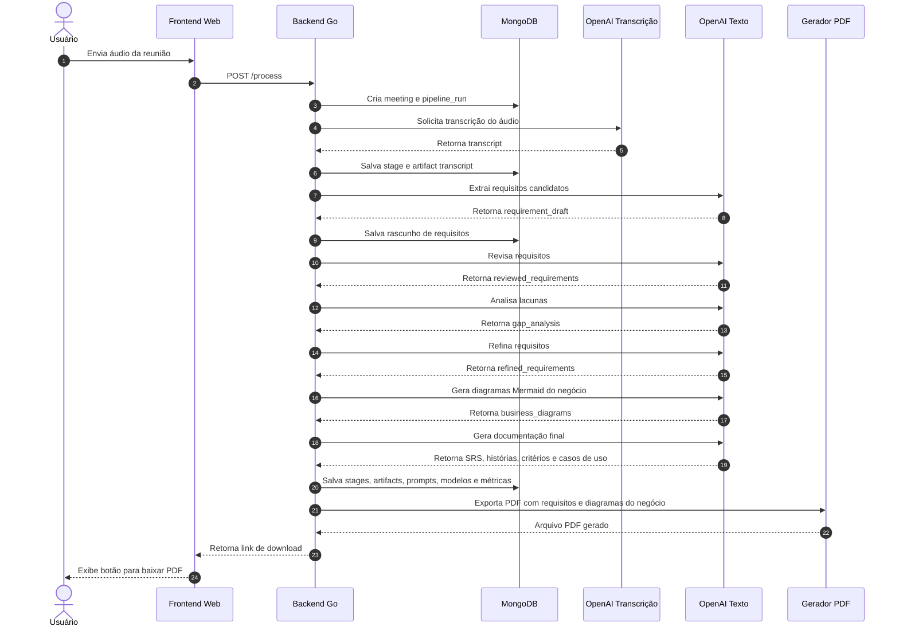

# Requirement Pipeline

MVP em Go para transformar o áudio de uma reunião de elicitação de requisitos em artefatos auditáveis de engenharia de requisitos.

## Requisitos

- Go 1.26 ou mais recente
- MongoDB acessível pela aplicação
- Chave da OpenAI em `OPENAI_API_KEY`
- Node.js com `npx` para renderizar os diagramas Mermaid no PDF quando o artifact `business_diagrams` estiver presente

## Configuração

A aplicação carrega o arquivo `.env` automaticamente e depois lê as variáveis de ambiente. Variáveis exportadas no ambiente têm prioridade sobre os valores do `.env`.

- `OPENAI_API_KEY`: obrigatória para execução real com OpenAI
- `OPENAI_TRANSCRIPTION_MODEL`: padrão `gpt-4o-transcribe`
- `OPENAI_TEXT_MODEL`: padrão `gpt-5`
- `MONGO_URI`: padrão `mongodb://localhost:27017`
- `MONGO_DATABASE`: padrão `requirement_pipeline`
- `PIPELINE_DEFAULT_LANGUAGE`: padrão `pt-BR`

## Execução Via CLI

```bash
go run ./cmd/requirement-pipeline -title "Reunião de descoberta" -audio ./meeting.mp3 -language pt-BR
```

Ao final de uma execução bem-sucedida, a CLI também exporta o artefato de requisitos refinados para:

```text
output/refined_requirements_<pipeline-run-id>_<meeting-id>.pdf
```

Você pode escolher outro diretório de saída com `-out`:

```bash
go run ./cmd/requirement-pipeline -title "Reunião de descoberta" -audio ./meeting.mp3 -out ./exports
```

Para reprocessar uma reunião existente, passe `-meeting-id <id>`. O reprocessamento cria uma nova execução da pipeline e preserva execuções, etapas e artefatos anteriores.

Para exportar um PDF de uma execução existente sem reprocessar e sem chamar a OpenAI novamente:

```bash
go run ./cmd/requirement-pipeline -export-run-id "<pipeline-run-id>"
```

## Frontend Web

Inicie o frontend minimalista de upload com:

```bash
go run ./cmd/requirement-pipeline -web -addr :8080
```

Depois abra `http://localhost:8080`, envie um arquivo de áudio, aguarde o processamento e use o botão de download para baixar o PDF gerado.

Os arquivos de áudio enviados são armazenados temporariamente em `uploads/` por padrão e removidos após o processamento. Os PDFs gerados são armazenados em `output/` por padrão e servidos pela rota `/downloads/<file>.pdf`. Use `-uploads` e `-out` para alterar esses diretórios.

## Como O Sistema Funciona

O sistema recebe um arquivo de áudio de reunião, executa uma sequência fixa de etapas com apoio de IA, salva cada passo da execução no MongoDB e exporta um PDF a partir do artefato de requisitos refinados.

### Diagrama De Sequência

O diagrama abaixo mostra o fluxo completo desde o envio do áudio até o download do PDF:



O arquivo-fonte do diagrama fica em `docs/diagrams/pipeline-sequence.mmd`.

O PDF gerado pela aplicação é focado em requisitos para implementação. Ele começa com um guia de leitura para o time, mostra as categorias de requisitos (`RF`, `RN`, `RNF` e `R`), inclui um checklist para transformar o material em backlog, apresenta fluxos de negócio específicos da reunião quando disponíveis e depois apresenta os requisitos refinados com títulos e listas mais legíveis.

Se quiser gerar uma imagem PNG do Mermaid para usar no texto do TCC, slides ou documentação externa, execute:

```bash
npx -y @mermaid-js/mermaid-cli -i docs/diagrams/pipeline-sequence.mmd -o docs/diagrams/pipeline-sequence.png -b white
```

Se o Mermaid CLI reclamar que não encontrou o Chrome headless, instale o browser usado pelo Puppeteer:

```bash
npx -y puppeteer browsers install chrome-headless-shell
```

O PNG em `docs/diagrams/pipeline-sequence.png` é complementar para documentação, slides ou texto do TCC. O PDF da aplicação prioriza a leitura dos requisitos por Product Owner, analistas e desenvolvedores.

### Diagramas De Negócio No PDF

Depois do refinamento dos requisitos, a pipeline executa a etapa `diagram_generation`. Essa etapa solicita ao modelo de texto de IA entre 1 e 3 diagramas Mermaid específicos do negócio discutido na reunião, evitando fluxos genéricos sobre requisitos, backlog ou implementação.

O artifact gerado é `business_diagrams` e usa JSON com esta estrutura:

```json
{
  "diagrams": [
    {
      "title": "Fluxo de Matrícula do Aluno",
      "type": "business_flow",
      "description": "Mostra o caminho desde o interesse até a liberação de acesso.",
      "mermaid": "flowchart TD\nA[Aluno interessado] --> B[Escolhe plano]\nB --> C[Acesso liberado]"
    }
  ]
}
```

Na exportação do PDF, a aplicação tenta renderizar cada Mermaid como PNG usando:

```bash
npx -y @mermaid-js/mermaid-cli -i <arquivo.mmd> -o <arquivo.png> -b white
```

Se o Mermaid CLI, o Chrome headless ou o próprio diagrama estiverem indisponíveis, o PDF continua sendo gerado com uma mensagem de fallback. Isso evita perder o documento de requisitos por causa de um problema visual.

Quando o Mermaid CLI reclamar que não encontrou o Chrome headless, instale o browser usado pelo Puppeteer:

```bash
npx -y puppeteer browsers install chrome-headless-shell
```

Se o Chrome headless estiver instalado em um caminho específico, exporte `PUPPETEER_EXECUTABLE_PATH` antes de rodar a aplicação.

A ordem da pipeline é:

| Ordem | Etapa | O que faz | Artefato principal gerado |
| --- | --- | --- | --- |
| 1 | `audio_transcription` | Envia o áudio para o provedor de fala-para-texto e converte a reunião em texto. | `transcript` |
| 2 | `requirement_extraction` | Lê a transcrição e extrai requisitos candidatos, classificados como requisitos funcionais, requisitos não funcionais, regras de negócio e restrições. | `requirement_draft` |
| 3 | `requirement_review` | Revisa os requisitos candidatos e aponta ambiguidades, duplicidades, inconsistências, conflitos e requisitos mal escritos. | `reviewed_requirements` |
| 4 | `gap_analysis` | Procura informações faltantes, requisitos implícitos, regras incompletas, perguntas pendentes e possíveis conflitos. | `gap_analysis` |
| 5 | `requirement_refinement` | Combina os requisitos revisados com a análise de lacunas para gerar requisitos mais claros, mensuráveis e rastreáveis. | `refined_requirements` |
| 6 | `diagram_generation` | Gera diagramas Mermaid específicos do negócio discutido na reunião. | `business_diagrams` |
| 7 | `artifact_generation` | Gera seções finais de documentação a partir dos requisitos refinados. | `software_requirement_specification`, `user_stories`, `acceptance_criteria`, `use_cases` |

A exportação para PDF usa `refined_requirements` e, quando disponível, `business_diagrams`. Os artefatos finais de documentação também são persistidos no MongoDB para auditoria e uso futuro.

## Coleções Do MongoDB

A aplicação salva dados em cinco coleções. Os dados de execuções, etapas, artefatos e prompts são intencionalmente incrementais: ao reprocessar, o sistema cria novos documentos em vez de sobrescrever o histórico anterior.

### `meetings`

Armazena a reunião cadastrada para processamento.

| Campo | Significado |
| --- | --- |
| `_id` | Identificador da reunião. |
| `title` | Título da reunião informado pela CLI ou pelo formulário web. |
| `audio_file` | Caminho do arquivo de áudio usado pela pipeline. No modo web, é o caminho temporário do arquivo enviado durante o processamento. |
| `language` | Idioma passado para os prompts, com padrão `pt-BR`. |
| `status` | Status da reunião, atualmente criado como `ready`. |
| `created_at` | Data e hora de criação da reunião. |

Use esta coleção para identificar qual áudio e qual idioma foram usados em uma reunião.

### `pipeline_runs`

Armazena uma execução da pipeline. Uma mesma reunião pode ter várias execuções quando é reprocessada.

| Campo | Significado |
| --- | --- |
| `_id` | Identificador da execução da pipeline. |
| `meeting_id` | Referência para `meetings._id`. |
| `started_at` | Data e hora de início da execução. |
| `finished_at` | Data e hora de término quando a execução conclui ou falha. |
| `status` | `running`, `completed` ou `failed`. |
| `failed_stage_id` | Identificador da etapa que falhou, quando aplicável. |
| `error` | Mensagem de erro de execuções com falha. |

Use esta coleção para verificar se uma tentativa de processamento concluiu, falhou ou ainda está em execução.

### `stages`

Armazena cada etapa executada dentro de uma execução da pipeline.

| Campo | Significado |
| --- | --- |
| `_id` | Identificador da execução da etapa. |
| `run_id` | Referência para `pipeline_runs._id`. |
| `name` | Nome da etapa, como `audio_transcription` ou `requirement_refinement`. |
| `status` | `running`, `completed` ou `failed`. |
| `started_at` | Data e hora de início da etapa. |
| `finished_at` | Data e hora de término da etapa. |
| `model` | Modelo de IA usado pela etapa. |
| `prompt_version` | Versão do prompt usada por etapas de geração de texto. |
| `duration_millis` | Duração da etapa em milissegundos. |
| `tokens` | Métricas de tokens retornadas pelo provedor, quando disponíveis. |
| `input_artifact_ids` | Identificadores dos artefatos usados como entrada. |
| `output_artifact_ids` | Identificadores dos artefatos produzidos pela etapa. |
| `error` | Mensagem de erro da etapa quando ela falha. |

Use esta coleção para auditar ordem de execução, duração de etapas, uso de modelo, uso de tokens, entradas, saídas e falhas.

### `artifacts`

Armazena todo artefato gerado por uma etapa.

| Campo | Significado |
| --- | --- |
| `_id` | Identificador do artefato. |
| `stage_id` | Referência para `stages._id`. |
| `type` | Tipo do artefato, como `transcript`, `requirement_draft`, `refined_requirements` ou `business_diagrams`. |
| `content` | Texto completo do artefato gerado pela etapa. |
| `created_at` | Data e hora de criação do artefato. |

Use esta coleção para inspecionar o conteúdo real gerado pela IA em cada ponto da pipeline.

### `prompts`

Armazena os templates de prompts padrão registrados quando a aplicação inicia um executor da pipeline.

| Campo | Significado |
| --- | --- |
| `_id` | Identificador do prompt. |
| `stage_name` | Etapa que usa o prompt. |
| `version` | Versão do prompt, atualmente `v1`. |
| `description` | Descrição curta do prompt. |
| `template` | Template do prompt com placeholders como `{{input}}`, `{{language}}`, `{{reviewed_requirements}}` e `{{gap_analysis}}`. |
| `created_at` | Data e hora de criação do prompt. |

Use esta coleção para inspecionar o texto do prompt usado por cada versão de etapa. As etapas atualmente registram `prompt_version`, não um ID direto do documento de prompt; portanto, correlacione prompts por `stage_name`, `version` e horário de criação próximo ao início da execução.

## Como Analisar Uma Execução No MongoDB

Abra o `mongosh` e selecione o banco configurado:

```javascript
use requirement_pipeline
```

Liste execuções recentes da pipeline:

```javascript
db.pipeline_runs.find().sort({ started_at: -1 }).limit(5).pretty()
```

Carregue uma execução e sua reunião:

```javascript
const run = db.pipeline_runs.findOne({ _id: "<pipeline-run-id>" })
db.meetings.findOne({ _id: run.meeting_id })
```

Inspecione a linha do tempo das etapas dessa execução:

```javascript
db.stages.find({ run_id: run._id }).sort({ started_at: 1 }).pretty()
```

Inspecione todos os artefatos produzidos por essa execução:

```javascript
const stageIds = db.stages.find({ run_id: run._id }).map(stage => stage._id)
db.artifacts.find({ stage_id: { $in: stageIds } }).sort({ created_at: 1 }).pretty()
```

Leia apenas o artefato de requisitos refinados usado para exportação do PDF:

```javascript
const refinementStage = db.stages.findOne({ run_id: run._id, name: "requirement_refinement" })
db.artifacts.findOne({ stage_id: refinementStage._id, type: "refined_requirements" })
```

Leia os diagramas de negócio gerados para o PDF:

```javascript
const diagramStage = db.stages.findOne({ run_id: run._id, name: "diagram_generation" })
db.artifacts.findOne({ stage_id: diagramStage._id, type: "business_diagrams" })
```

Analise uma execução com falha:

```javascript
db.pipeline_runs.findOne({ _id: "<pipeline-run-id>" })
db.stages.find({ run_id: "<pipeline-run-id>" }).sort({ started_at: 1 }).pretty()
```

Para falhas, verifique `pipeline_runs.status`, `pipeline_runs.error`, `pipeline_runs.failed_stage_id`, `stages.status` e `stages.error`.

Compare tentativas de reprocessamento da mesma reunião:

```javascript
db.pipeline_runs.find({ meeting_id: "<meeting-id>" }).sort({ started_at: 1 }).pretty()
```

Inspecione os templates de prompt:

```javascript
db.prompts.find().sort({ created_at: -1 }).pretty()
```

Inspecione o prompt mais recente registrado para uma etapa:

```javascript
db.prompts.find({ stage_name: "requirement_refinement" }).sort({ created_at: -1 }).limit(1).pretty()
```

## Fluxo De Auditoria

Para entender o que aconteceu em uma execução, siga esta ordem:

1. Comece por `pipeline_runs` para identificar status, timestamps e o `meeting_id` relacionado.
2. Abra `meetings` para confirmar título, caminho do áudio e idioma.
3. Consulte `stages` por `run_id`, ordenando por `started_at`, para ver a sequência exata de processamento.
4. Para cada etapa, use `input_artifact_ids` e `output_artifact_ids` para entender quais dados entraram e saíram da etapa.
5. Consulte `artifacts` para ler o conteúdo gerado, especialmente `transcript`, `requirement_draft`, `reviewed_requirements`, `gap_analysis`, `refined_requirements` e `business_diagrams`.
6. Verifique `model`, `prompt_version`, `duration_millis` e `tokens` em `stages` para avaliar uso de modelo e performance.
7. Verifique `prompts` para entender o template que orientou cada etapa de IA.
8. Se a execução falhou, inspecione `pipeline_runs.error`, `pipeline_runs.failed_stage_id` e o `stages.error` da etapa com falha.

## Testes

```bash
go test ./...
```

Os testes usam providers de IA mockados e repositórios em memória, então não chamam OpenAI nem MongoDB.
